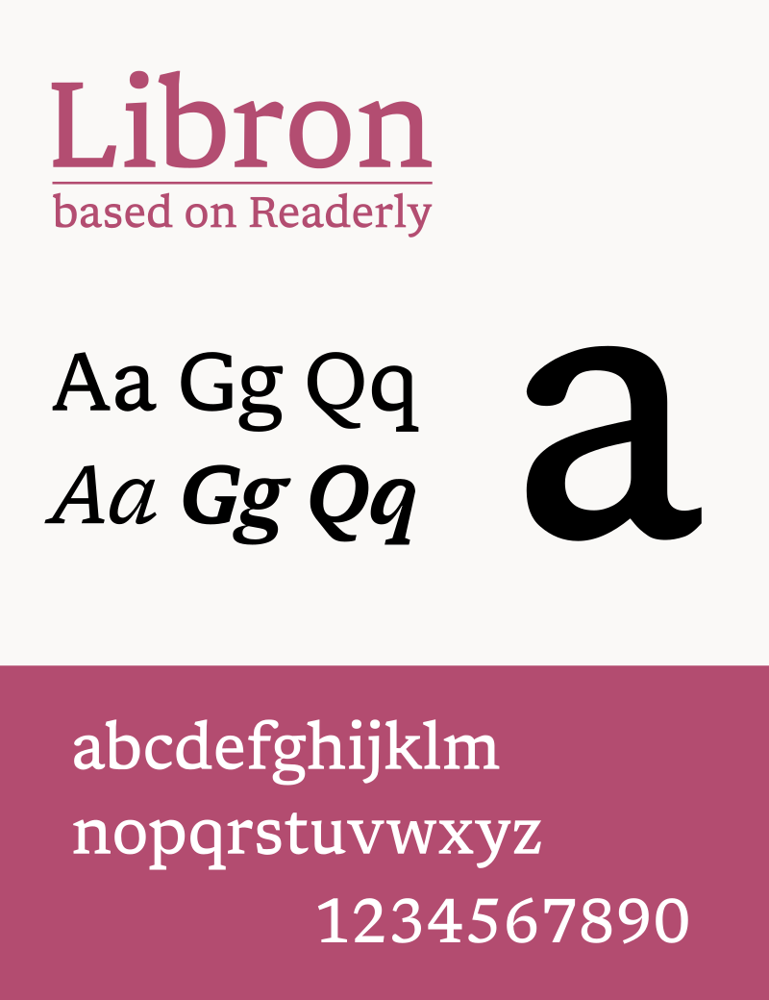

#  Libron

**Libron** is a modified version of [Readerly](https://github.com/nicoverbruggen/readerly) with various edits to give the font a more neutral look.

The original font was imported and has been manually edited using [FontForge](https://fontforge.org). All modified source files are available in the `src` directory.

I may eventually roll these changes into Readerly at some point. For now, I'm currently evaluating it as a separate font, and as such it co-exists alongside Readerly.

## Specimen

## General changes

The changes made to this font are mostly to modify some of the stylistically heavy serifs that were originally part of Newsreader.

- For example, many capitals have been modified, e.g. `C`, `E`, `F`, `G`, `L` and `S` have very noticeably been trimmed down.
- Certain glyphs have been reworked: `T` is one such example, but some lowercase characters, too, like `d`, `i`, `j`, `t`, `r` and `u`. Minor adjustments have been made across the board to serifs, as well.
- Fixed composite glyphs which were originally pre-composed in Readerly.
- Adjusted left and right bearings after glyph modifications.

Due to the size changes applied with Readerly, I figured it would be a good idea to tweak certain aspects of the serif design to make it less "loud" when reading books.

## Building Libron

### Automatic builds

When a commit of Libron is tagged, a version is automatically released. The version number set in [VERSION](./VERSION) is used when building the font, and is embedded within the font.

The following variants are generated:

- Libron for desktop (TTF)
- Libron for [Kobo devices](https://github.com/nicoverbruggen/kobo-font-fix) (KF TTF)
- Libron Web (WOFF2) 

### Building locally

You can run `./local-build.sh` if you have Podman installed to build the definitive fonts. If you have all dependencies installed locally, you can also use `./build.py` to build the font with Python.

## License

This font is available under the [OFL license](./LICENSE).