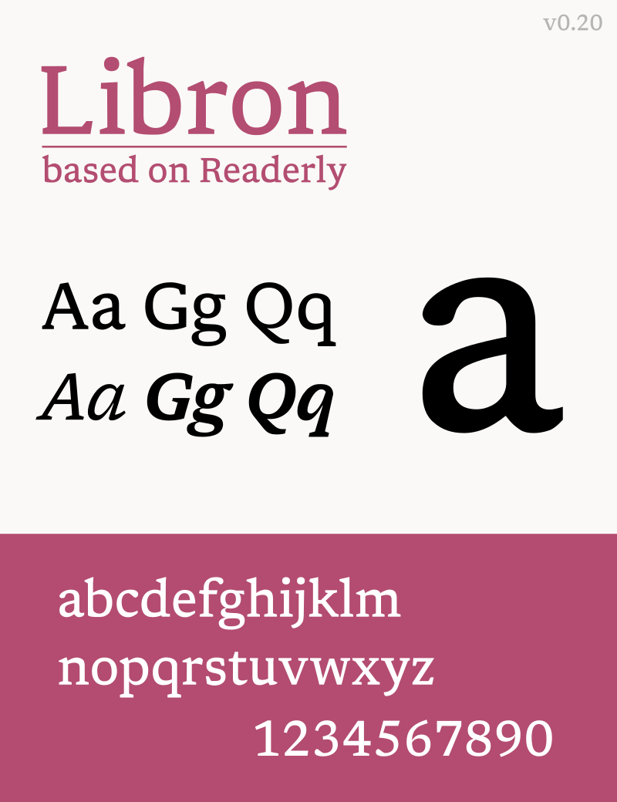

#  Libron

**Libron** is a modified version of [Readerly](https://github.com/nicoverbruggen/readerly) with various edits to give the font a more neutral look. 

The original font was imported and has been manually edited using [FontForge](https://fontforge.org). All modified source files are available in the `src` directory.

## Specimen

## General changes

Libron started as an attempt to make Readerly feel a little more appropriate for reading on e-readers. Some of the more expressive details that are part of Readerly stood out more than I wanted.

In particular, some of the serifs and capital forms seemed too distracting as I was reading.

What started as a few tweaks to the serifs to make the different font files a little more neutral has gradually developed into a broader reworking of Readerly's design:

- Many uppercase and lowercase letters, figures and punctuation marks have now been redrawn or refined across all four styles. 
- Spacing and kerning have been adjusted alongside the outlines to create a more even reading texture.
- Accented characters have been rebuilt where necessary, so that they remain consistent with their base glyphs.

The result keeps Readerly's proportions and overall character, but has a calmer and more neutral appearance intended specifically for reading books. As such, it is a successor to Readerly.

## Building Libron

### Automatic builds

When a commit of Libron is tagged, a version is automatically released. The version number set in [VERSION](./VERSION) is used when building the font, and is embedded within the font.

The following variants are generated:

- Libron for desktop (`TTF`)
- Libron for [Kobo devices](https://github.com/nicoverbruggen/kobo-font-fix) (`KF TTF`)
- Libron's webfont variant (`WOFF2`) 

Libron for devices running CrossPoint Reader (`cpfont`) is built and published in [ebook-fonts](https://github.com/nicoverbruggen/ebook-fonts).

### Building locally

You can run `./local-build.sh` if you have Podman installed to build the definitive fonts. If you have all dependencies installed locally, you can also use `./build.py` to build the font with Python.

## License

This font is available under the [OFL license](./LICENSE).
