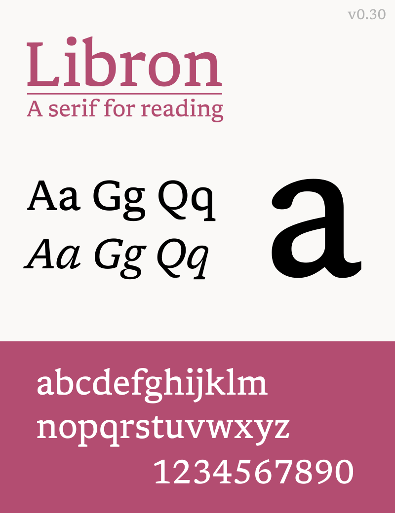
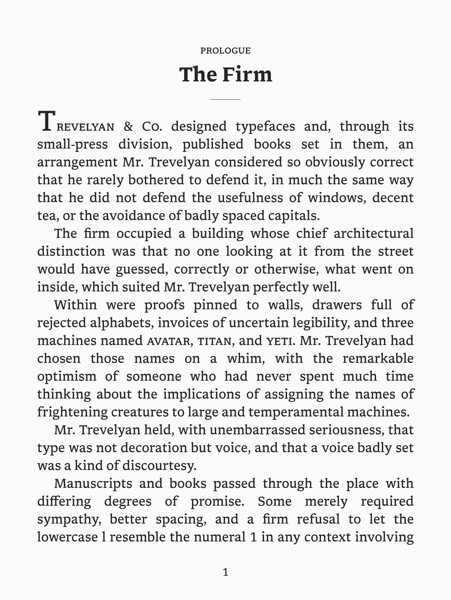

#  Libron

> [!NOTE]
> If this font has been useful to you, please **star the repository** so I know it is being used. Please also consider [a donation](https://nicoverbruggen.be/donate) to support the project, which I work on in my free time. **Thank you!**

**Libron** is a modified version of [Readerly](https://github.com/nicoverbruggen/readerly) with various edits to give the font a more neutral look. 

The original font was imported and has been manually edited using [FontForge](https://fontforge.org). All modified source files are available in the `src` directory.

## Specimen



## Reading sample



The sample shows the opening page of the public-domain prologue of [Trevelyan's Type Tester](https://github.com/nicoverbruggen/type-tester-epub), with native small caps, an enlarged initial and indented paragraphs. It uses a simulated 7-inch e-reader display at 1264 × 1680 pixels, with 36-pixel body type.

## General changes

Libron started as an attempt to make Readerly feel a little more appropriate for reading on e-readers. Some of the more expressive details that are part of Readerly stood out more than I wanted.

In particular, some of the serifs and capital forms seemed too distracting as I was reading.

What started as a few tweaks to the serifs to make the different font files a little more neutral has gradually developed into a broader reworking of Readerly's design:

- Many uppercase and lowercase letters, figures and punctuation marks have now been redrawn or refined across all four styles. 
- Spacing and kerning have been adjusted alongside the outlines to create a more even reading texture.
- Accented characters have been rebuilt where necessary, so that they remain consistent with their base glyphs.
- Synthetic small caps were added to the font, based on scaled down capitals for each four styles.

The result keeps Readerly's proportions and overall character, but has a calmer and more neutral appearance intended specifically for reading books. As such, it is a successor to Readerly.

## Building Libron

### Automatic builds

When a commit of Libron is tagged, a version is automatically released. The version number set in [VERSION](./VERSION) is used when building the font, and is embedded within the font.

The following variants are generated:

- Libron for desktop (`TTF`)
- Libron for [Kobo devices](https://github.com/nicoverbruggen/kobo-font-fix) (`KF TTF`)
- Libron for [CrossPoint Reader](https://github.com/crosspoint-reader/crosspoint-reader#custom-sd-card-fonts) (`cpfont`)
- Libron's webfont variant (`WOFF2`) 

### Building locally

You can run `./local-build.sh` if you have Podman installed to build the definitive fonts. If you have all dependencies installed locally, you can also use `./build.py` to build the font with Python.

The local wrapper builds Kobo and CrossPoint variants by default. Use `--without-crosspoint` to skip CrossPoint. With `build.py`, add `--with-crosspoint` to generate the bundles. To convert existing TTFs without rebuilding them, run `python3 scripts/build_cpfont.py` in the `fntbld-oci` container. CrossPoint builds need network access to download the converter pinned in [scripts/build_cpfont.py](./scripts/build_cpfont.py).

Font builds do not regenerate the README images. Before a release, bump [VERSION](./VERSION) and run `scripts/release.sh` to generate the changelog section and refresh `specimen.svg` and `sample.svg`. The script builds the current sources, so the images use the release's outlines, kerning, ligatures and version. Review and commit the notes and images before creating the tag. The script does not commit, tag or push.

To edit the specimen layout or sample text, change [scripts/generate_specimens.py](./scripts/generate_specimens.py). To regenerate the images from an existing build without rebuilding the fonts, run:

```sh
podman run --rm -v "$PWD":/work -w /work ghcr.io/nicoverbruggen/fntbld-oci:latest python3 scripts/generate_specimens.py
```

The generator needs `fonttools` and the HarfBuzz shared library, both included in `fntbld-oci`. CI builds the fonts and uses the committed README images.

## License

This font is available under the [OFL license](./LICENSE).

Libron is a Reserved Font Name. Modified versions must use a different primary font name unless Nico Verbruggen gives written permission.
